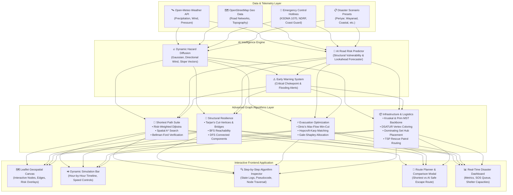

# 🚨 PlanEsc: AI-Driven Dynamic Escape Planner During Natural Disasters

[](https://reactjs.org/)
[](https://www.typescriptlang.org/)
[](https://vitejs.dev/)
[](https://leafletjs.com/)
[](LICENSE)

> **PlanEsc** is an enterprise-grade emergency evacuation and disaster response intelligence system that combines **Advanced Graph Algorithms (AGA)** with **AI-driven dynamic hazard propagation models**. It computes risk-averse evacuation routes, identifies critical infrastructure bottlenecks, optimizes emergency supply backbones, and orchestrates rescue operations in real time during catastrophic disaster events.

---

## 📌 Table of Contents

1. [Executive Summary & Problem Statement](#-executive-summary--problem-statement)
2. [Core Mathematical & Graph Formulation](#-core-mathematical--graph-formulation)
3. [System Architecture](#-system-architecture)
4. [Advanced Graph Algorithms Suite (Detailed Analysis)](#-advanced-graph-algorithms-suite-detailed-analysis)
   - [1. Dynamic Risk-Weighted Dijkstra's Algorithm](#1-dynamic-risk-weighted-dijkstras-algorithm)
   - [2. A* Informed Escape Routing with Spatial Heuristics](#2-a-informed-escape-routing-with-spatial-heuristics)
   - [3. Bellman-Ford Safety Verification & Cycle Detection](#3-bellman-ford-safety-verification--cycle-detection)
   - [4. Tarjan's Bridge & Cut-Vertex Resilience Analysis](#4-tarjans-bridge--cut-vertex-resilience-analysis)
   - [5. Minimum Spanning Trees (Kruskal & Prim) for Emergency Backbones](#5-minimum-spanning-trees-kruskal--prim-for-emergency-backbones)
   - [6. Dinic's Max-Flow Min-Cut Evacuation Capacity Optimization](#6-dinics-max-flow-min-cut-evacuation-capacity-optimization)
   - [7. Hopcroft-Karp & Gale-Shapley Bipartite Matching](#7-hopcroft-karp--gale-shapley-bipartite-matching)
   - [8. Vertex Coloring (DSATUR) for Phased Evacuation Scheduling](#8-vertex-coloring-dsatur-for-phased-evacuation-scheduling)
   - [9. Minimum Dominating Set for Strategic Relief Hub Placement](#9-minimum-dominating-set-for-strategic-relief-hub-placement)
   - [10. Traveling Salesperson (TSP) & Vehicle Routing for Rescue Convoys](#10-traveling-salesperson-tsp--vehicle-routing-for-rescue-convoys)
5. [AI Hazard Diffusion & Predictive Engine](#-ai-hazard-diffusion--predictive-engine)
   - [Physical Spatio-Temporal Hazard Spread](#physical-spatio-temporal-hazard-spread)
   - [AI Predictive Road Risk Assessment](#ai-predictive-road-risk-assessment)
   - [Live Meteorological Telemetry & Alert Mapping](#live-meteorological-telemetry--alert-mapping)
6. [Realistic Disaster Presets & Scenarios](#-realistic-disaster-presets--scenarios)
7. [User Interface & Interactive Features](#-user-interface--interactive-features)
8. [Tech Stack & Dependencies](#-tech-stack--dependencies)
9. [Project Directory Structure](#-project-directory-structure)
10. [Getting Started & Installation](#-getting-started--installation)
11. [Verification & Build Guide](#-verification--build-guide)
12. [License & Acknowledgments](#-license--acknowledgments)

---

## 🌪️ Executive Summary & Problem Statement

During catastrophic natural events—such as monsoonal mega-floods, catastrophic landslides, coastal storm surges, earthquakes, and forest fires—standard consumer routing engines (e.g., Google Maps, Apple Maps) often fail or misdirect civilians into danger zones because:
- **Static Map Assumptions**: They calculate routes based on distance and normal traffic delay, unaware of active hazard fronts, rapid water level rises, or structural washouts.
- **Lack of Predictive Foresight**: They cannot anticipate that a mountain pass or bridge will become impassable within 30 minutes due to upstream dam releases or slope instability.
- **Shelter Inefficiencies**: Evacuees overwhelm the closest shelter while distant, high-capacity relief hubs remain under-utilized.
- **Rescue Misallocation**: First responders (NDRF, Fire Force, Army Engineering teams, Amphibious units) lack algorithmic task matching for priority-based dispatch.

**PlanEsc** bridges this gap by marrying **AI hazard forecasting models** with **discrete mathematics and advanced graph algorithms**, delivering real-time decision support for emergency responders and affected populations.

---

## 📐 Core Mathematical & Graph Formulation

The disaster landscape is modeled as a dynamic weighted directed/undirected multigraph:

$$G(t) = \big(V, E(t), W(t)\big)$$

### 1. Vertex Definitions $V$
Each vertex $v \in V$ represents a spatial infrastructure node defined by:
$$\mathbf{v} = \langle \text{id}, \text{lat}, \text{lng}, \text{elevation}, \text{type}, \text{population}, \text{capacity}, \text{risk}(t) \rangle$$
Where $\text{type} \in \{\text{junction}, \text{shelter}, \text{hospital}, \text{depot}, \text{isolated\_cluster}\}$.

### 2. Edge Definitions $E(t)$
Each edge $e = (u, v) \in E(t)$ models a transport link characterized by:
$$\mathbf{e} = \langle \text{length}, \text{baseSpeed}, \text{slope}, \text{roadType}, \text{trafficDensity}(t), \text{hazardRisk}(t), \text{predictedRisk}(t), \text{isBlocked}(t) \rangle$$
Where $\text{roadType} \in \{\text{highway}, \text{secondary}, \text{bridge}, \text{tunnel}, \text{mountain\_pass}, \text{waterway}\}$.

### 3. Dynamic Cost Weight Function $W(e, t)$
The operational impedance of traversing an edge $e$ under active disaster conditions is given by:

$$W(e, t) = \begin{cases} 
\infty, & \text{if } e.\text{isBlocked} \lor R_{\text{eff}}(e, t) \ge 0.92 \\
T_{\text{base}}(e) \cdot \Phi_{\text{traffic}}(e, t) \cdot \Psi_{\text{slope}}(e) \cdot \Omega_{\text{safety}}(e, t), & \text{otherwise}
\end{cases}$$

Where:
- **Base Travel Time**: $T_{\text{base}}(e) = \frac{e.\text{distance}}{\max(e.\text{baseSpeed}, 10)} \times 60 \quad (\text{minutes})$
- **Traffic Congestion Multiplier**: $\Phi_{\text{traffic}}(e, t) = 1 + 1.8 \cdot e.\text{trafficDensity}(t)$
- **Elevation Gradient Penalty**: $\Psi_{\text{slope}}(e) = 1 + 0.5 \cdot \max\left(0, \frac{e.\text{slope}}{100}\right)$
- **Effective Risk**: $R_{\text{eff}}(e, t) = \min\big(0.99, \max(e.\text{hazardRisk}, 0.9 \cdot e.\text{predictedRisk})\big)$
- **Exponential Safety Barrier**:
  $$\Omega_{\text{safety}}(e, t) = \left(\frac{1}{1 - R_{\text{eff}}(e, t)}\right)^\kappa, \quad \kappa = 3.0$$

---

## 🏗️ System Architecture



---

## 🧮 Advanced Graph Algorithms Suite (Detailed Analysis)

### 1. Dynamic Risk-Weighted Dijkstra's Algorithm
- **File**: [`src/algorithms/shortestPath.ts`](file:///c:/Users/bless/GIT/PlanEsc/src/algorithms/shortestPath.ts)
- **Objective**: Finds the single-source safest path from an affected community node to the nearest accessible emergency shelter.
- **Operational Logic**: Uses a Min-Priority Queue keyed by cumulative risk-penalized time cost $W(e, t)$. Whenever an edge has high hazard immersion ($R_{\text{eff}} \ge 0.92$), it is dynamically treated as impassable ($\infty$), forcing the algorithm to seek high-ground alternatives.
- **Time Complexity**: $\mathcal{O}((V + E) \log V)$
- **Disaster Context**: Evacuates individuals through unflooded, clear corridors rather than leading them into rising floodwaters.

### 2. A* Informed Escape Routing with Spatial Heuristics
- **File**: [`src/algorithms/shortestPath.ts`](file:///c:/Users/bless/GIT/PlanEsc/src/algorithms/shortestPath.ts)
- **Objective**: Accelerated point-to-point escape path generation using geographic Haversine distance heuristics.
- **Heuristic Function**:
  $$h(u, \text{target}) = \frac{\text{HaversineDist}(u, \text{target})}{\text{MaxSpeed}} \times 60$$
- **Time Complexity**: $\mathcal{O}(E)$ average with consistent heuristic.
- **Disaster Context**: Enables sub-millisecond route recalculation for thousands of live evacuees as road closures occur dynamically.

### 3. Bellman-Ford Safety Verification & Cycle Detection
- **File**: [`src/algorithms/shortestPath.ts`](file:///c:/Users/bless/GIT/PlanEsc/src/algorithms/shortestPath.ts)
- **Objective**: Validates the overall network cost matrix, checks graph reachability, and identifies potential cascading risk loops.
- **Time Complexity**: $\mathcal{O}(V \cdot E)$
- **Disaster Context**: Ensures routing integrity under extreme conditions where penalty functions might otherwise produce numerical anomalies.

### 4. Tarjan's Bridge & Cut-Vertex Resilience Analysis
- **File**: [`src/algorithms/connectivity.ts`](file:///c:/Users/bless/GIT/PlanEsc/src/algorithms/connectivity.ts)
- **Objective**: Discovers critical chokepoints—vertices (articulation points) and edges (bridges)—whose failure will partition the graph into disconnected components.
- **Formulation**: Maintains Depth-First Search discovery times $\text{disc}(u)$ and lowest reachable ancestry numbers $\text{low}(u)$:
  $$\text{low}(v) \ge \text{disc}(u) \implies u \text{ is an articulation point}$$
  $$\text{low}(v) > \text{disc}(u) \implies (u, v) \text{ is a critical bridge}$$
- **Time Complexity**: $\mathcal{O}(V + E)$
- **Disaster Context**: Alerts emergency commanders to station engineering teams (such as Bailey bridge units) at vulnerable single-point-of-failure bridges before they collapse.

### 5. Minimum Spanning Trees (Kruskal & Prim) for Emergency Backbones
- **File**: [`src/algorithms/mst.ts`](file:///c:/Users/bless/GIT/PlanEsc/src/algorithms/mst.ts)
- **Objective**: Constructs the minimal-cost connected subgraph spanning all critical facilities (hospitals, shelters, command centers) using the lowest aggregate hazard risk.
- **Algorithms**:
  - **Kruskal's**: Employs Disjoint-Set Union (DSU) with path compression and union-by-rank.
  - **Prim's**: Grows the tree from the central command hub using priority queues.
- **Time Complexity**: $\mathcal{O}(E \log E)$ (Kruskal), $\mathcal{O}(E + V \log V)$ (Prim).
- **Disaster Context**: Guides the deployment of emergency satellite communication cables, tactical radio relays, and military relief supply convoys.

### 6. Dinic's Max-Flow Min-Cut Evacuation Capacity Optimization
- **File**: [`src/algorithms/maxFlow.ts`](file:///c:/Users/bless/GIT/PlanEsc/src/algorithms/maxFlow.ts)
- **Objective**: Maximizes total civilian throughput (people/hour) moving from danger origin zones to safe shelters, and locates exact bottleneck road cuts.
- **Methodology**: Constructs a layered network using BFS, then pushes blocking flow along augmenting paths using DFS.
- **Time Complexity**: $\mathcal{O}(V^2 E)$
- **Disaster Context**: Determines the theoretical maximum evacuation capacity and highlights congested roads that require traffic police intervention.

### 7. Hopcroft-Karp & Gale-Shapley Bipartite Matching
- **File**: [`src/algorithms/matching.ts`](file:///c:/Users/bless/GIT/PlanEsc/src/algorithms/matching.ts)
- **Objective**:
  - **Rescue Matching**: Matches specialized rescue squads (amphibious boats, NDRF, ambulances) to active SOS distress beacons based on proximity, terrain capability, and team capacity.
  - **Shelter Allocation**: Implements Stable Matching (Gale-Shapley) to allocate displaced populations to shelters without exceeding maximum bed capacities.
- **Time Complexity**: $\mathcal{O}(E \sqrt{V})$ (Hopcroft-Karp)
- **Disaster Context**: Prevents double-dispatching rescue assets and prevents shelter overcrowding.

### 8. Vertex Coloring (DSATUR) for Phased Evacuation Scheduling
- **File**: [`src/algorithms/vertexColoring.ts`](file:///c:/Users/bless/GIT/PlanEsc/src/algorithms/vertexColoring.ts)
- **Objective**: Assigns distinct time departure slots (colors) to adjacent residential zones whose evacuation routes share common intersections.
- **Heuristic**: Degree of Saturation (DSATUR) dynamically colors vertices with the highest number of differently colored neighbors first.
- **Time Complexity**: $\mathcal{O}(V^2)$
- **Disaster Context**: Prevents massive intersection gridlocks by staggering evacuation waves across neighboring sectors.

### 9. Minimum Dominating Set for Strategic Relief Hub Placement
- **File**: [`src/algorithms/dominatingSet.ts`](file:///c:/Users/bless/GIT/PlanEsc/src/algorithms/dominatingSet.ts)
- **Objective**: Identifies the minimal subset of nodes $D \subseteq V$ such that every node in $V$ is either in $D$ or adjacent to a node in $D$.
- **Methodology**: Greedy logarithmic approximation selecting nodes that maximize coverage of unserviced adjacent vertices.
- **Time Complexity**: $\mathcal{O}(V + E)$
- **Disaster Context**: Places emergency medical aid stations, clean water distribution points, and food supply depots so that every civilian is within immediate reach of a station.

### 10. Traveling Salesperson (TSP) & Vehicle Routing for Rescue Convoys
- **File**: [`src/algorithms/tspVrp.ts`](file:///c:/Users/bless/GIT/PlanEsc/src/algorithms/tspVrp.ts)
- **Objective**: Computes the shortest, lowest-risk closed tour starting from a relief depot, visiting multiple isolated distress locations, and returning safely.
- **Optimization**: Nearest-Neighbor construction followed by iterative 2-Opt edge swapping.
- **Time Complexity**: $\mathcal{O}(V^2)$
- **Disaster Context**: Coordinates medical supply drop-offs and reconnaissance patrol routes for disaster management teams.

---

## 🧠 AI Hazard Diffusion & Predictive Engine

```
       [ Upstream Dam Release / Cloudburst / High Seas ]
                             │
                             ▼
     ┌──────────────────────────────────────────────────┐
     │      Physical Hazard Diffusion Model (t)         │
     │   • Radial Gaussian Dissipation                  │
     │   • Directional Wind Vector Projection           │
     │   • Topographic Slope & Elevation Attenuation    │
     └───────────────────────┬──────────────────────────┘
                             │
                             ▼
     ┌──────────────────────────────────────────────────┐
     │      AI Road Risk Forecaster (t + Δt)            │
     │   • Structural Vulnerability (Bridges/Passes)    │
     │   • Rainfall Accumulation & Soil Saturation      │
     │   • Traffic Density Congestion Surge Multipliers │
     └───────────────────────┬──────────────────────────┘
                             │
                             ▼
     ┌──────────────────────────────────────────────────┐
     │      Dynamic Graph Edge Impedance Updates        │
     │   • W(e, t) Dynamic Cost Recalculation           │
     │   • Automatic Road Closure at Thresholds         │
     └──────────────────────────────────────────────────┘
```

### Physical Spatio-Temporal Hazard Spread
Located in [`src/ai/hazardSpread.ts`](file:///c:/Users/bless/GIT/PlanEsc/src/ai/hazardSpread.ts):
- **Flood Diffusion**: Incorporates rainfall rate and riverbed elevation differentials:
  $$r_{\text{eff}} = r_0 \cdot \left(1 + \frac{\text{Rainfall}_{\text{mm/h}}}{50} \times 0.5\right)$$
- **Wildfire Elliptical Spread**: Projects coordinates along the wind vector $\vec{w}$:
  $$\left(\frac{x_{\text{downwind}}}{r_{\text{forward}}}\right)^2 + \left(\frac{y_{\text{crosswind}}}{r_{\text{flank}}}\right)^2 \le 1.0$$
- **Landslide Risk**: Evaluates localized slope angle and precipitation saturation.

### AI Predictive Road Risk Assessment
Located in [`src/ai/roadRiskPredictor.ts`](file:///c:/Users/bless/GIT/PlanEsc/src/ai/roadRiskPredictor.ts):
Predicts the probability of road failure at $t + \Delta t$ (lookahead time) based on:
1. **Structural Vulnerability Multipliers**:
   - Bridges: $1.4\times$
   - Tunnels: $1.5\times$
   - Mountain Passes: $1.6\times$
2. **Expansion Rate of Approaching Hazard Fronts**.
3. **Slope vs. Rainfall Interlocking Factors**.

### Live Meteorological Telemetry & Alert Mapping
Located in [`src/ai/keralaLiveApi.ts`](file:///c:/Users/bless/GIT/PlanEsc/src/ai/keralaLiveApi.ts):
- Real-time telemetry fetched from the **Open-Meteo API** (hourly precipitation, wind speed, WMO weather codes).
- Automatic mapping to official meteorological disaster alert levels:
  - 🔴 **Red Alert**: Rainfall $\ge 204.5\text{ mm}$ (Extreme flash flood & landslide risk).
  - 🟠 **Orange Alert**: Rainfall $115.6 - 204.4\text{ mm}$ (Very heavy rain; river basins on high alert).
  - 🟡 **Yellow Alert**: Rainfall $64.5 - 115.5\text{ mm}$ (Heavy monsoon rain; localized waterlogging).
- Emergency hotline integration (State Disaster Control `1070`, District Collectorate `1077`, National Emergency `112`, Coast Guard `1554`).

---

## 🌊 Realistic Disaster Presets & Scenarios

| Scenario Preset | Category | Key Geographic Nodes | Primary Hazard Mechanism |
| :--- | :--- | :--- | :--- |
| **Kerala Monsoon Deluge (Periyar & Kuttanad)** | Megaflood | Idukki Dam, Cheruthoni, Aluva, Kalamassery, Kochi | Dam shutter discharge causing severe river basin overflow and coastal backwater submergence. |
| **Wayanad Ghats Landslide Catastrophe** | Landslide | Chooralmala, Mundakkai, Meppadi, Attamala, Kalpetta | Cloudburst-triggered high-altitude mudflows destroying bridges and cutting off plantation hamlets. |
| **South Kerala Coastal Surge & Cyclone Alert** | Coastal Surge / Cyclone | Shanghumugham, Vizhinjam, Varkala, Kollam Port | Deep depression in the Arabian Sea driving high storm tides, embankment breaches, and gale-force squalls. |
| **Malabar Chaliyar River Flooding** | River Flood | Mavoor, Feroke, Nilambur, Kozhikode Urban | Heavy catchment downpours overflowing the Chaliyar basin and inundating low-lying transportation corridors. |
| **Coastal Flood Standard Preset** | Flood | Metro Coastal Grid | Tidal surge inundation of low-lying urban sectors. |
| **Seismic Metro Preset** | Earthquake | Metro Core & Suburban Ring | Severe ground shaking causing structural collapses and bridge failures. |
| **Wildfire Forest Firefront** | Wildfire | Forest Reserves & Mountain Passes | Wind-driven firefront advancing towards valley settlements. |
| **Mountain Landslide Preset** | Landslide | Alpine Highway & Valley Hubs | Debris blockades on high-gradient transit arteries. |

---

## 🖥️ User Interface & Interactive Features

1. **Geospatial Canvas (`MapCanvas.tsx`)**:
   - Leaflet map rendering with dynamic node and edge color-coding based on hazard risk, road type, and algorithm state.
   - Dynamic pulsing markers for active distress SOS beacons, rescue units, and evacuation shelters.
2. **Simulation Control Bar (`SimulationBar.tsx`)**:
   - Play/Pause time-lapse simulation with adjustable playback speeds ($1\times, 2\times, 5\times$).
   - Hazard growth multiplier controls to test mild vs extreme disaster escalations.
3. **Step Inspector (`StepInspector.tsx`)**:
   - Granular execution controls (First, Previous, Next, Last Step) with explanations of each algorithmic transition.
   - Highlighting of active nodes, examined edges, updated distance tables, and color assignments.
4. **Route Planner Modal (`RoutePlannerModal.tsx`)**:
   - Side-by-side comparison of **AI Safe Route** vs **Standard Shortest Path**.
   - Metric displays for total distance, estimated travel time, maximum hazard exposure, and passability safety index.
5. **Real-Time Disaster Dashboard**:
   - **Metrics Bar**: Total nodes, active road links, impassable bridges, current live weather alerts.
   - **Shelter List**: Real-time shelter occupancy percentages, remaining capacity, and triage status.
   - **Distress Panel**: Incoming SOS requests, priority levels (P1/P2/P3), and dispatched rescue team assignments.

---

## 💻 Tech Stack & Dependencies

```json
{
  "dependencies": {
    "react": "^18.3.1",
    "react-dom": "^18.3.1",
    "leaflet": "^1.9.4",
    "lucide-react": "^1.16.0",
    "clsx": "^2.1.1"
  },
  "devDependencies": {
    "@types/react": "^18.3.18",
    "@types/react-dom": "^18.3.5",
    "@types/leaflet": "^1.9.16",
    "@vitejs/plugin-react": "^4.3.4",
    "typescript": "^5.7.3",
    "vite": "^6.1.0"
  }
}
```

---

## 📁 Project Directory Structure

```text
PlanEsc/
├── index.html                   # HTML entry page with responsive viewport & meta tags
├── package.json                 # Project dependencies, metadata, and scripts
├── tsconfig.json                # TypeScript compiler options
├── vite.config.ts               # Vite configuration and React plugins
├── README.md                    # Comprehensive documentation and technical specification
└── src/
    ├── main.tsx                 # React application mounting point
    ├── App.tsx                  # Root component orchestrating state, simulation, and algorithms
    │
    ├── ai/                      # AI & Predictive Modeling
    │   ├── hazardSpread.ts      # Spatial hazard expansion (Gaussian / wind vector models)
    │   ├── keralaLiveApi.ts     # Open-Meteo telemetry & IMD alert classification
    │   └── roadRiskPredictor.ts # Predictive road risk calculation & lookahead warnings
    │
    ├── algorithms/              # Advanced Graph Algorithms
    │   ├── bfsDfs.ts            # BFS reachability and DFS connected components
    │   ├── shortestPath.ts      # Risk-weighted Dijkstra, A* search, Bellman-Ford
    │   ├── connectivity.ts      # Tarjan's bridge and cut-vertex resilience analysis
    │   ├── mst.ts               # Kruskal's & Prim's minimum spanning tree backbones
    │   ├── maxFlow.ts           # Dinic's Max-Flow Min-Cut evacuation throughput
    │   ├── matching.ts          # Hopcroft-Karp rescue matching & Gale-Shapley shelter allocation
    │   ├── vertexColoring.ts    # DSATUR phased evacuation scheduling
    │   ├── dominatingSet.ts     # Minimum dominating set relief hub placement
    │   └── tspVrp.ts            # TSP nearest-neighbor and 2-Opt rescue tour routing
    │
    ├── components/              # Modular UI Components
    │   ├── algorithms/          # AlgorithmSelector & StepInspector components
    │   ├── controls/            # SimulationBar & HazardEditor controls
    │   ├── dashboard/           # MetricsBar, ShelterList, DistressPanel widgets
    │   ├── map/                 # MapCanvas (Leaflet map & custom overlays)
    │   └── navigation/          # Header, Emergency Hotlines, RoutePlannerModal
    │
    ├── data/                    # Datasets & Scenario Presets
    │   ├── defaultGraph.ts      # Scenario loading logic & graph graph construction
    │   └── scenarios/           # Realistic disaster scenarios (Periyar, Wayanad, etc.)
    │
    ├── styles/                  # Styling & UI tokens
    │   └── index.css            # Dark mode tokens, glassmorphism, animations
    │
    └── types/                   # TypeScript Type Definitions
        ├── graph.ts             # Graph nodes, edges, hazard zones, algorithm results
        └── simulation.ts        # Disaster presets, distress calls, rescue teams, weather
```

---

## 🚀 Getting Started & Installation

### Prerequisites
- **Node.js**: `v18.0.0` or higher installed on your workstation.
- **npm** (comes with Node.js) or **pnpm** / **yarn**.

### Installation Steps

1. **Clone the Repository**:
   ```bash
   git clone https://github.com/SamSunny4/AGA.git
   cd AGA
   ```

2. **Install Dependencies**:
   ```bash
   npm install
   ```

3. **Start Development Server**:
   ```bash
   npm run dev
   ```
   Open your browser and navigate to `http://localhost:5173`.

---

## 🧪 Verification & Build Guide

To verify type safety and produce an optimized production bundle:

```bash
# Type-check and build production bundle
npm run build

# Preview the production bundle locally
npm run preview
```

---

## 📄 License & Acknowledgments

This project is licensed under the [MIT License](LICENSE).

Developed as an advanced academic and practical implementation demonstrating the convergence of **Advanced Graph Algorithms (AGA)**, **Geospatial Intelligence**, and **AI Disaster Risk Modeling** for humanitarian life-safety operations.
